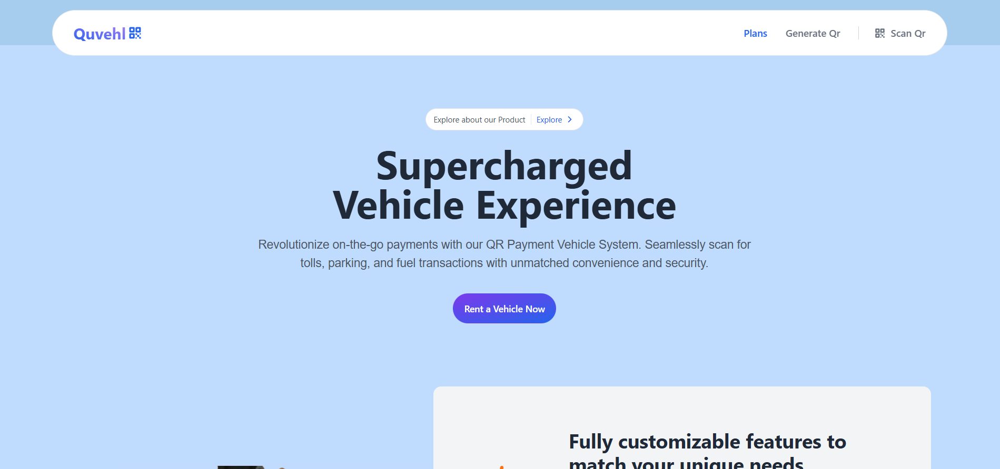

# 🚗 QR-Based Vehicle Management System



A smart and efficient system for managing vehicle travel, service requests, and payments using QR codes. Built with a focus on automation, real-time tracking, and seamless user experience.

## 🔧 Features

- ✅ **QR Code Generation & Scanning** – For secure vehicle entry, attendance, or identification.
- 🛠 **WR (Work Request) Generation** – Submit and manage vehicle service or maintenance requests easily.
- 💳 **Razorpay Integration** – Secure payment gateway for quick and reliable transactions.
- 🧠 **Smart & Powerful Tools** – Designed to simplify vehicle and travel management using automation.
- 📊 **Admin & User Dashboards** – Intuitive UI for tracking and controlling service history and travel logs.

## 🚀 Technologies Used

- Frontend: `React.js`, `Tailwind CSS`
- Backend: `Node.js`, `Express.js`
- Database: `MongoDB`
- Payment: `Razorpay API`
- QR: `html5-qrcode`, `qrcode.react`

## 🛠 Installation

```bash
git clone https://github.com/Nyayabrata01/QrBased_Vechile.git
cd QrBased_Vechile
npm install
npm start
